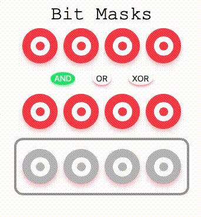

## Day3. Bitmask Simulator

---

## Description
4 bis bitmasking simulator for: `AND`, `OR`, and `XOR`. 

[Demo](https://bitmask-simulator.netlify.app/)

## Reference
- Button design: [Oleg Frolov - CodePen](https://codepen.io/CodeMeNatalie/pen/qBENxOP?editors=0110)
- [1 Day 1 Project](https://github.com/euisblue/OneDay_OneProject) 
